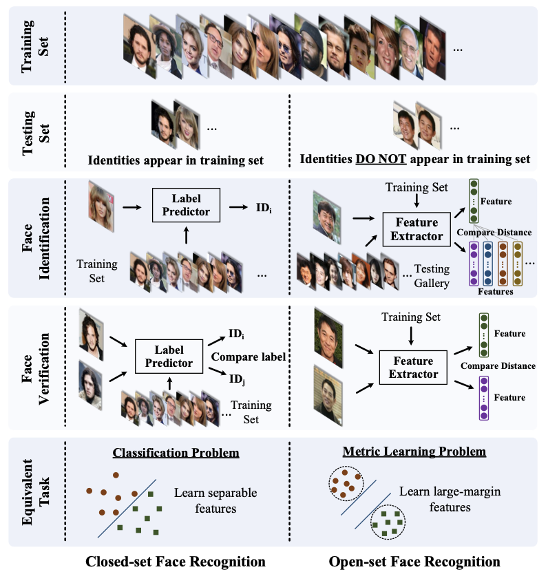
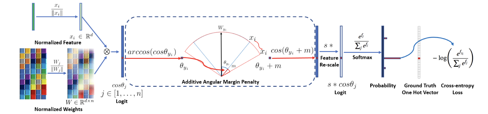
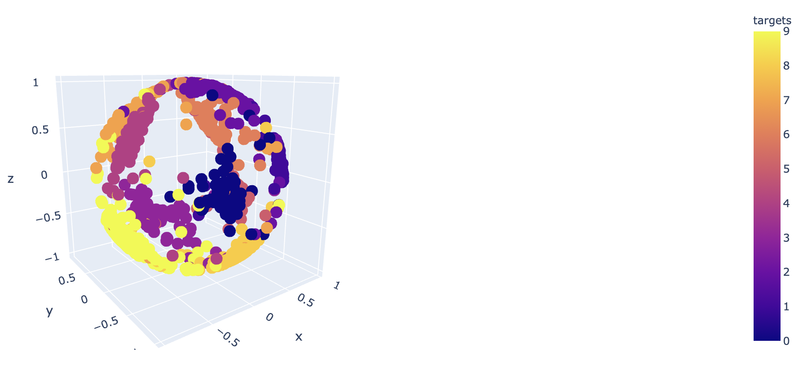
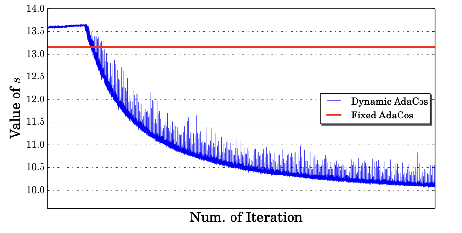
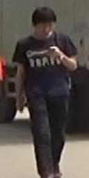
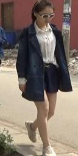

# Research and developing summary 
## Files describe:

**Data** -  folder should contain initial dataset and results of preprocessing.

**Models** -  folder contains (now only the final solution) all the models and training logs.

**Notebooks** - contains notebooks:
- ArcFace-mnist-demo.ipynb - ArcFace loss demo on MNIST dataset.
- data-preparation.ipynb , all the data preparation stuff.
- swin.py - implementation of Shifted Windows Transformer from Microsoft
- training.py - contains loss implementation, models and training scripts

## Approach describe:
### Objective: 
Train accurate feature extractor, that given 2 images containing a full body we can get their representation and using cosine distance determine whether it belongs to the same person or not.

### Data processing
Used dataset: http://liuyu.us/dataset/lpw/index.html
There are photos of people in three different scenes and multiple photos on each scene.

Dataset contains *480k* images from *3* different cameras recorded same person
data classes were unbalanced, so initial trials to train models weren't successful.

Initial Class (images per person) distribution:

I decided to balance dataset in such way:
- Remove minor classes that are less than 0.25 quantile (82 samples per class).
- Upsample minor classes with augmentation to reach a threshold with 200 samples.
- Downsample major classes to 200 samples.

For test set was chosen **23** random classes.
Final train set has **2370** classes.
Each class contains **200** images.

After review I found that the dataset is pretty noisy, so it was decided to filter the test set by hands.

### Deep metric learning solution

To replace standard metric learning approaches was chosen *SOTA* method of training using modified soft max functions.

The first basic approach was described in 
*Y. Sun, X. Wang, and X. Tang. Deep learning face representation from predicting 10,000 classes. In CVPR, 2014.*
training common image classifier with Cross Entropy Loss on predefined number of classes (persons), and after that CNN backbone showed that it is able to represent new unseen classes.

**First approach** was to use *ArcFace: Additive Angular Margin Loss for Deep Face Recognition*
https://arxiv.org/pdf/1801.07698.pdf

 
 Short description of approach, we create projections of extracted features onto the hyper-sphere and inside the loss we create a weight matrix with centers of each class, and our goal to minimize cosine distance between class representation and each relative center and maximize between other classes.

 Here is example of plotting mnist embeddings:
  
 
 This loss has 2 hyper-parameters M and S, which stands for margin and scale respectively.
 Margin - is the additional penalty to make our model create more extra-class margin.
 Scale - is the parameter to make our gradients more dramatic and helps to converge faster.
 
 But there is a problem with choosing these hyper-parameters and making model training stable.
 
So the next solution was to try another *SOTA*:
*AdaCos: Adaptively Scaling Cosine Logits for Effectively Learning Deep Face Representations*
https://arxiv.org/pdf/1905.00292.pdf

The researchers found that there is huge impact of S and M values on the final result, so they found if S value was chosen right, value M can be ignored.

They introduced 2 ways of choosing S parameter:
- Fixed - we apply formula to derive S parameter from our amount of classes in training set
- Adaptive - by the formula we apply the median angle between the correct class. If it is large we need less strict supervision, but if it is small we apply more supervision to divide classes even more.

### Backbone
As the backbone utilized:
- **Efficient Net** B0, B1, B2, B3, B4.
*Efficient Net: Rethinking Model Scaling for Convolutional Neural Networks*
https://arxiv.org/pdf/1905.11946.pdf

 - **Swin Transformer**:
*Swin Transformer: Hierarchical Vision Transformer using Shifted Windows*
https://arxiv.org/pdf/2103.14030.pdf

- **ResNet50**

The final model was chosen using Efficient Net B1 backbone

Despite all the hopes Swin Transformer doensn't perform well.
I suppose because:
1) Unnecessarily large model, final model was 10 million params,
but the smallest Swin has 55 million.
2) All the useful features extracted from the image are local, but Swin tries to find relationships between different patches of the image.

### Results

Model converged on train set up to **87%** accuracy with batches and **94%** while the evaluation.

The test set was evaluated using 2 random images randomly from one of different classes.
Final accuracy reached: **95.43%** 

Inference example:

 
Cosine distance - *0.87*

 
Cosine distance - *0.93*

 
Cosine distance -  *-0.04*
